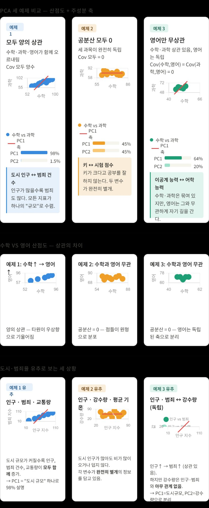

# PCA 분석 — Cov(X₁,X₃) = Cov(X₂,X₃) = 0, Cov(X₁,X₂) ≠ 0

> **변수 설정:** $X_1$ = 수학, $X_2$ = 과학, $X_3$ = 영어


## 시각적 개요 — PCA 세 예제 비교



> **그림 설명:** 위쪽 행은 수학 vs 과학 산점도와 PC1 축(빨간선), 분산 기여율 막대.  
> 가운데 행은 수학 vs 영어 산점도로 상관 구조 차이를 확인.  
> 아래 행은 도시·범죄율 유추로 각 상황의 직관적 의미를 보여준다.

---

## 0. 이 예제의 설계 목표

| 조건 | 값 | 의미 |
|------|----|------|
| Cov(X₁, X₂) | **6** (≠ 0) | 수학·과학 성적은 서로 상관 있음 |
| Cov(X₁, X₃) | **0** | 수학·영어 성적은 무상관 |
| Cov(X₂, X₃) | **0** | 과학·영어 성적은 무상관 |
| Var(X₁) | **10** | 수학 점수의 분산 |
| Var(X₂) | **10** | 과학 점수의 분산 |
| Var(X₃) | **5** | 영어 점수의 분산 |

> **핵심 질문:**  
> $X_3$(영어)가 $X_1$, $X_2$ 모두와 무상관이면 PCA는 어떤 축을 찾는가?  
> $X_1$-$X_2$ 사이의 상관은 고유벡터 방향에 어떤 영향을 주는가?

---

## 1. 데이터 설계 원리

평균 중심화 벡터 $\tilde{\mathbf{x}}_j$ 를 먼저 설계한다 ($n = 5$, $\text{ddof} = 1$).

$$
\text{Var}(X_j) = \frac{\tilde{\mathbf{x}}_j \cdot \tilde{\mathbf{x}}_j}{n-1},
\qquad
\text{Cov}(X_j, X_k) = \frac{\tilde{\mathbf{x}}_j \cdot \tilde{\mathbf{x}}_k}{n-1}
$$

설계한 중심화 벡터:

| 벡터 | 과목 | 값 | 원소 합 | 제곱합 | Var |
|------|------|----|:-------:|:------:|:---:|
| $\tilde{\mathbf{x}}_1$ | 수학 | $[+4,\ -4,\ +2,\ -2,\ 0]$ | 0 | 40 | **10** |
| $\tilde{\mathbf{x}}_2$ | 과학 | $[+4,\ -4,\ -2,\ +2,\ 0]$ | 0 | 40 | **10** |
| $\tilde{\mathbf{x}}_3$ | 영어 | $[+1,\ +1,\ +1,\ +1,\ -4]$ | 0 | 20 | **5** |

### 내적 계산으로 공분산 확인

$$
\tilde{\mathbf{x}}_1 \cdot \tilde{\mathbf{x}}_2
= (4)(4) + (-4)(-4) + (2)(-2) + (-2)(2) + (0)(0)
= 16 + 16 - 4 - 4 + 0 = 24
\quad\Rightarrow\quad
\text{Cov}(X_1, X_2) = \frac{24}{4} = \mathbf{6}
$$

$$
\tilde{\mathbf{x}}_1 \cdot \tilde{\mathbf{x}}_3
= (4)(1) + (-4)(1) + (2)(1) + (-2)(1) + (0)(-4)
= 4 - 4 + 2 - 2 + 0 = 0
\quad\Rightarrow\quad
\text{Cov}(X_1, X_3) = \frac{0}{4} = \mathbf{0}
$$

$$
\tilde{\mathbf{x}}_2 \cdot \tilde{\mathbf{x}}_3
= (4)(1) + (-4)(1) + (-2)(1) + (2)(1) + (0)(-4)
= 4 - 4 - 2 + 2 + 0 = 0
\quad\Rightarrow\quad
\text{Cov}(X_2, X_3) = \frac{0}{4} = \mathbf{0}
$$

---

## 2. 원본 데이터 행렬

평균: $\bar{X}_1 = 50$ (수학), $\quad \bar{X}_2 = 60$ (과학), $\quad \bar{X}_3 = 70$ (영어)

| 학생 | 수학 $X_1$ | 과학 $X_2$ | 영어 $X_3$ |
|:----:|:---------:|:---------:|:---------:|
| A    | 54        | 64        | 71        |
| B    | 46        | 56        | 71        |
| C    | 52        | 58        | 71        |
| D    | 48        | 62        | 71        |
| E    | 50        | 60        | 66        |

---

## 3. STEP 1 — 평균 및 중심화

$$
\bar{X}_1 = \frac{54+46+52+48+50}{5} = \frac{250}{5} = 50
$$

$$
\bar{X}_2 = \frac{64+56+58+62+60}{5} = \frac{300}{5} = 60
$$

$$
\bar{X}_3 = \frac{71+71+71+71+66}{5} = \frac{350}{5} = 70
$$

중심화 행렬 $\tilde{X} = X - \mathbf{1}\bar{\mathbf{x}}^T$:

$$
\tilde{X} = \begin{pmatrix}
 4 &  4 &  1 \\
-4 & -4 &  1 \\
 2 & -2 &  1 \\
-2 &  2 &  1 \\
 0 &  0 & -4
\end{pmatrix}
$$

| 학생 | $\tilde{x}_1$ (수학) | $\tilde{x}_2$ (과학) | $\tilde{x}_3$ (영어) |
|:----:|:-------------------:|:-------------------:|:-------------------:|
| A    | +4                  | +4                  | +1                  |
| B    | -4                  | -4                  | +1                  |
| C    | +2                  | -2                  | +1                  |
| D    | -2                  | +2                  | +1                  |
| E    |  0                  |  0                  | -4                  |

---

## 4. STEP 2 — 공분산 행렬

$$
\Sigma = \frac{1}{n-1}\,\tilde{X}^T \tilde{X} = \frac{1}{4}\,\tilde{X}^T \tilde{X}
$$

### 분산 계산

$$
\text{Var}(X_1) = \frac{4^2 + (-4)^2 + 2^2 + (-2)^2 + 0^2}{4}
= \frac{16+16+4+4+0}{4} = \frac{40}{4} = \mathbf{10}
$$

$$
\text{Var}(X_2) = \frac{4^2 + (-4)^2 + (-2)^2 + 2^2 + 0^2}{4}
= \frac{16+16+4+4+0}{4} = \frac{40}{4} = \mathbf{10}
$$

$$
\text{Var}(X_3) = \frac{1^2 + 1^2 + 1^2 + 1^2 + (-4)^2}{4}
= \frac{1+1+1+1+16}{4} = \frac{20}{4} = \mathbf{5}
$$

### 공분산 계산

$$
\text{Cov}(X_1, X_2)
= \frac{(4)(4)+(-4)(-4)+(2)(-2)+(-2)(2)+(0)(0)}{4}
= \frac{16+16-4-4+0}{4} = \frac{24}{4} = \mathbf{6}
$$

$$
\text{Cov}(X_1, X_3) = \mathbf{0}, \qquad \text{Cov}(X_2, X_3) = \mathbf{0}
$$

### 공분산 행렬

$$
\boxed{
\Sigma =
\begin{pmatrix}
10 & 6 & 0 \\
6 & 10 & 0 \\
0 & 0 & 5
\end{pmatrix}
}
$$

> **구조 관찰:** $X_3$(영어)가 $X_1$, $X_2$ 모두와 무상관이므로  
> 3행·3열이 나머지 블록과 완전히 분리된 **블록 대각 행렬** 구조가 된다.

$$
\Sigma =
\left(\begin{array}{cc|c}
10 & 6 & 0 \\
6 & 10 & 0 \\
\hline
0 & 0 & 5
\end{array}\right)
\qquad
\begin{array}{l}
\Bigg\} \quad X_1\text{-}X_2 \text{ 블록 (수학-과학, 2}\times\text{2)} \\
\\
\Big\} \quad X_3 \text{ 블록 (영어, 1}\times\text{1)}
\end{array}
$$

---

## 5. STEP 3 — 고유값 계산

$$
\det(\Sigma - \lambda I) = 0
$$

$$
\det\begin{pmatrix}
10 - \lambda & 6 & 0 \\
6 & 10 - \lambda & 0 \\
0 & 0 & 5 - \lambda
\end{pmatrix} = 0
$$

3열로 여인수 전개(cofactor expansion):

$$
(5 - \lambda) \det\begin{pmatrix} 10-\lambda & 6 \\ 6 & 10-\lambda \end{pmatrix} = 0
$$

$$
(5 - \lambda) \left[ (10-\lambda)^2 - 6^2 \right] = 0
$$

$$
(5 - \lambda)(10 - \lambda - 6)(10 - \lambda + 6) = 0
$$

$$
(5 - \lambda)(4 - \lambda)(16 - \lambda) = 0
$$

$$
\boxed{\lambda_1 = 16, \qquad \lambda_2 = 5, \qquad \lambda_3 = 4}
$$

---

## 6. STEP 4 — 고유벡터 계산

### 6-1. $\lambda_1 = 16$ 에 대한 $\mathbf{v}_1$

$$
(\Sigma - 16I)\,\mathbf{v} = \mathbf{0}
$$

$$
\begin{pmatrix}
10-16 & 6 & 0 \\
6 & 10-16 & 0 \\
0 & 0 & 5-16
\end{pmatrix}
\begin{pmatrix} v_1 \\ v_2 \\ v_3 \end{pmatrix}
=
\begin{pmatrix}
-6 & 6 & 0 \\
6 & -6 & 0 \\
0 & 0 & -11
\end{pmatrix}
\begin{pmatrix} v_1 \\ v_2 \\ v_3 \end{pmatrix}
= \mathbf{0}
$$

**행별 전개:**

$$
\text{행 1}:\quad -6v_1 + 6v_2 + 0 \cdot v_3 = 0
\quad\Rightarrow\quad v_1 = v_2
$$

$$
\text{행 2}:\quad 6v_1 - 6v_2 + 0 \cdot v_3 = 0
\quad\Rightarrow\quad v_1 = v_2 \qquad (\text{행 1과 동일, 추가 정보 없음})
$$

$$
\text{행 3}:\quad 0 \cdot v_1 + 0 \cdot v_2 - 11 v_3 = 0
\quad\Rightarrow\quad v_3 = 0
$$

**가우스 소거:**

$$
R_2 \leftarrow R_2 + R_1
\quad\Rightarrow\quad
\begin{pmatrix}
-6 & 6 & 0 \\
0 & 0 & 0 \\
0 & 0 & -11
\end{pmatrix}
\quad \text{rank} = 2, \text{ 자유변수 1개}
$$

$v_2 = t$ (자유변수)로 놓으면 $v_1 = t,\ v_3 = 0$. $t = 1$을 대입하면:

$$
\mathbf{v}_1^{*} = \begin{pmatrix} 1 \\ 1 \\ 0 \end{pmatrix},
\qquad
\|\mathbf{v}_1^{*}\| = \sqrt{1^2 + 1^2 + 0^2} = \sqrt{2}
$$

**정규화:**

$$
\boxed{
\mathbf{v}_1 = \frac{1}{\sqrt{2}}\begin{pmatrix} 1 \\ 1 \\ 0 \end{pmatrix}
= \begin{pmatrix} 0.7071 \\ 0.7071 \\ 0 \end{pmatrix}
}
$$

> **해석:** $v_1 = v_2 = \frac{1}{\sqrt{2}}$, $v_3 = 0$  
> → 수학($X_1$)과 과학($X_2$)을 동등한 비중으로 합산하는 방향  
> → 영어($X_3$)는 이 주성분에 전혀 기여하지 않는다

---

### 6-2. $\lambda_2 = 5$ 에 대한 $\mathbf{v}_2$

$$
(\Sigma - 5I)\,\mathbf{v} = \mathbf{0}
$$

$$
\begin{pmatrix}
10-5 & 6 & 0 \\
6 & 10-5 & 0 \\
0 & 0 & 5-5
\end{pmatrix}
\begin{pmatrix} v_1 \\ v_2 \\ v_3 \end{pmatrix}
=
\begin{pmatrix}
5 & 6 & 0 \\
6 & 5 & 0 \\
0 & 0 & 0
\end{pmatrix}
\begin{pmatrix} v_1 \\ v_2 \\ v_3 \end{pmatrix}
= \mathbf{0}
$$

**행별 전개:**

$$
\text{행 1}:\quad 5v_1 + 6v_2 + 0 \cdot v_3 = 0
$$

$$
\text{행 2}:\quad 6v_1 + 5v_2 + 0 \cdot v_3 = 0
$$

$$
\text{행 3}:\quad 0 = 0
\qquad (\text{항등식} \Rightarrow v_3 \text{ 은 자유변수})
$$

**가우스 소거:**

$$
R_2 \leftarrow R_2 - \frac{6}{5} R_1
\quad\Rightarrow\quad
\begin{pmatrix}
5 & 6 & 0 \\
0 & 5 - \frac{36}{5} & 0 \\
0 & 0 & 0
\end{pmatrix}
=
\begin{pmatrix}
5 & 6 & 0 \\
0 & -\frac{11}{5} & 0 \\
0 & 0 & 0
\end{pmatrix}
\quad \text{rank} = 2, \text{ 자유변수 1개}
$$

행 2에서:

$$
-\frac{11}{5} v_2 = 0 \quad\Rightarrow\quad v_2 = 0
$$

행 1에서:

$$
5 v_1 + 6(0) = 0 \quad\Rightarrow\quad v_1 = 0
$$

$v_3 = t$ (자유변수). $t = 1$을 대입하면:

$$
\mathbf{v}_2^{*} = \begin{pmatrix} 0 \\ 0 \\ 1 \end{pmatrix},
\qquad
\|\mathbf{v}_2^{*}\| = 1
$$

**정규화:**

$$
\boxed{
\mathbf{v}_2 = \begin{pmatrix} 0 \\ 0 \\ 1 \end{pmatrix}
}
$$

> **해석:** $v_1 = 0,\ v_2 = 0,\ v_3 = 1$  
> → 오직 영어($X_3$) 방향만  
> Cov($X_3$, $X_1$) = Cov($X_3$, $X_2$) = 0 이므로  
> PCA가 영어를 회전 없이 독립적인 주성분으로 분리한 결과

---

### 6-3. $\lambda_3 = 4$ 에 대한 $\mathbf{v}_3$

$$
(\Sigma - 4I)\,\mathbf{v} = \mathbf{0}
$$

$$
\begin{pmatrix}
10-4 & 6 & 0 \\
6 & 10-4 & 0 \\
0 & 0 & 5-4
\end{pmatrix}
\begin{pmatrix} v_1 \\ v_2 \\ v_3 \end{pmatrix}
=
\begin{pmatrix}
6 & 6 & 0 \\
6 & 6 & 0 \\
0 & 0 & 1
\end{pmatrix}
\begin{pmatrix} v_1 \\ v_2 \\ v_3 \end{pmatrix}
= \mathbf{0}
$$

**행별 전개:**

$$
\text{행 1}:\quad 6v_1 + 6v_2 + 0 \cdot v_3 = 0
\quad\Rightarrow\quad v_1 = -v_2
$$

$$
\text{행 2}:\quad 6v_1 + 6v_2 + 0 \cdot v_3 = 0
\qquad (\text{행 1과 동일, 추가 정보 없음})
$$

$$
\text{행 3}:\quad 0 \cdot v_1 + 0 \cdot v_2 + 1 \cdot v_3 = 0
\quad\Rightarrow\quad v_3 = 0
$$

**가우스 소거:**

$$
R_2 \leftarrow R_2 - R_1
\quad\Rightarrow\quad
\begin{pmatrix}
6 & 6 & 0 \\
0 & 0 & 0 \\
0 & 0 & 1
\end{pmatrix}
\quad \text{rank} = 2, \text{ 자유변수 1개}
$$

$v_2 = t$ (자유변수)로 놓으면 $v_1 = -t,\ v_3 = 0$. $t = 1$을 대입하면:

$$
\mathbf{v}_3^{*} = \begin{pmatrix} -1 \\ 1 \\ 0 \end{pmatrix},
\qquad
\|\mathbf{v}_3^{*}\| = \sqrt{(-1)^2 + 1^2 + 0^2} = \sqrt{2}
$$

**정규화:**

$$
\boxed{
\mathbf{v}_3 = \frac{1}{\sqrt{2}}\begin{pmatrix} -1 \\ 1 \\ 0 \end{pmatrix}
= \begin{pmatrix} -0.7071 \\ 0.7071 \\ 0 \end{pmatrix}
}
$$

> **해석:** $v_1 = -\frac{1}{\sqrt{2}}$ (수학), $v_2 = +\frac{1}{\sqrt{2}}$ (과학), $v_3 = 0$ (영어)  
> → 과학에서 수학을 뺀 차이 방향  
> → 영어는 이 주성분에 기여하지 않는다

---

### 6-4. 고유벡터 직교성 검증

$$
\mathbf{v}_1 \cdot \mathbf{v}_2
= \frac{1}{\sqrt{2}} \cdot 0
+ \frac{1}{\sqrt{2}} \cdot 0
+ 0 \cdot 1
= 0 \quad \checkmark
$$

$$
\mathbf{v}_1 \cdot \mathbf{v}_3
= \frac{1}{\sqrt{2}} \cdot \left( -\frac{1}{\sqrt{2}} \right)
+ \frac{1}{\sqrt{2}} \cdot \frac{1}{\sqrt{2}}
+ 0 \cdot 0
= -\frac{1}{2} + \frac{1}{2} = 0 \quad \checkmark
$$

$$
\mathbf{v}_2 \cdot \mathbf{v}_3
= 0 \cdot \left( -\frac{1}{\sqrt{2}} \right)
+ 0 \cdot \frac{1}{\sqrt{2}}
+ 1 \cdot 0
= 0 \quad \checkmark
$$

세 고유벡터는 서로 직교하는 단위벡터, 즉 **정규직교(orthonormal)** 기저를 이룬다.

---

## 7. STEP 5 — 분산 설명 비율

$$
\text{전체 분산} = \lambda_1 + \lambda_2 + \lambda_3 = 16 + 5 + 4 = 25
$$

| 주성분 | 고유값 | 기여율 | 누적 기여율 | 방향 해석 |
|:------:|:------:|:------:|:-----------:|-----------|
| PC1 | 16 | **64.0%** | 64.0%     | 수학·과학 합산 방향 |
| PC2 |  5 | **20.0%** | **84.0%** | 영어 독립 방향      |
| PC3 |  4 | 16.0%     | 100.0%    | 과학·수학 차이 방향 |

PC1 + PC2 두 개로 전체 분산의 **84%** 보존 가능하다.

---

## 8. PC와 원래 과목의 관계식

주성분 점수는 고유벡터를 가중치로 삼은 중심화 원점수의 선형결합이다.

$$
\text{PC}_k = \mathbf{v}_k^T \tilde{\mathbf{x}}
= v_{k1}(X_1 - \bar{X}_1) + v_{k2}(X_2 - \bar{X}_2) + v_{k3}(X_3 - \bar{X}_3)
$$

---

### PC1 — "수학 + 과학" 합산 방향

$$
\mathbf{v}_1 = \begin{pmatrix} \frac{1}{\sqrt{2}} \\ \frac{1}{\sqrt{2}} \\ 0 \end{pmatrix}
$$

$$
\boxed{
\text{PC1}
= \frac{1}{\sqrt{2}}(X_1 - 50) + \frac{1}{\sqrt{2}}(X_2 - 60) + 0 \cdot (X_3 - 70)
= \frac{(X_1 - 50) + (X_2 - 60)}{\sqrt{2}}
}
$$

- $X_3$(영어) 계수 = 0 이므로 영어 점수는 PC1에 전혀 기여하지 않는다
- $X_1$(수학)과 $X_2$(과학) 계수가 모두 $\frac{1}{\sqrt{2}}$ 로 동일하다 → **동등한 비중**으로 합산
- 수학과 과학이 평균 이상일수록 PC1 값이 크다

수치 확인 (학생 A):

$$
\text{PC1}_A = \frac{(54-50) + (64-60)}{\sqrt{2}} = \frac{4 + 4}{\sqrt{2}} = \frac{8}{\sqrt{2}} = 4\sqrt{2} \approx 5.657
$$

---

### PC2 — "영어" 독립 방향

$$
\mathbf{v}_2 = \begin{pmatrix} 0 \\ 0 \\ 1 \end{pmatrix}
$$

$$
\boxed{
\text{PC2}
= 0 \cdot (X_1 - 50) + 0 \cdot (X_2 - 60) + 1 \cdot (X_3 - 70)
= X_3 - 70
}
$$

- $X_1$(수학), $X_2$(과학) 계수 = 0 이므로 수학·과학은 PC2에 전혀 기여하지 않는다
- PC2 = 영어 점수의 평균 편차 그 자체
- Cov($X_3$, $X_1$) = Cov($X_3$, $X_2$) = 0 이기 때문에  
  PCA가 영어를 별도 축으로 독립 분리한 결과

수치 확인 (학생 E):

$$
\text{PC2}_E = 66 - 70 = -4
$$

---

### PC3 — "과학 − 수학" 차이 방향

$$
\mathbf{v}_3 = \begin{pmatrix} -\frac{1}{\sqrt{2}} \\ \frac{1}{\sqrt{2}} \\ 0 \end{pmatrix}
$$

$$
\boxed{
\text{PC3}
= -\frac{1}{\sqrt{2}}(X_1 - 50) + \frac{1}{\sqrt{2}}(X_2 - 60) + 0 \cdot (X_3 - 70)
= \frac{(X_2 - 60) - (X_1 - 50)}{\sqrt{2}}
}
$$

- 과학(+) vs 수학(-) 방향 → 수학보다 과학을 잘할수록 PC3 값이 크다
- 분산 $\lambda_3 = 4$ 로 가장 작아 제거 후보 (전체의 16%만 설명)
- $X_3$(영어) 계수 = 0 이므로 영어는 PC3에도 기여하지 않는다

---

### 세 주성분의 관계식 요약

$$
\begin{pmatrix} \text{PC1} \\ \text{PC2} \\ \text{PC3} \end{pmatrix}
=
\begin{pmatrix}
\frac{1}{\sqrt{2}} & \frac{1}{\sqrt{2}} & 0 \\
0 & 0 & 1 \\
-\frac{1}{\sqrt{2}} & \frac{1}{\sqrt{2}} & 0
\end{pmatrix}
\begin{pmatrix} X_1 - 50 \\ X_2 - 60 \\ X_3 - 70 \end{pmatrix}
$$

| 주성분 | 수학 $X_1$ 계수 | 과학 $X_2$ 계수 | 영어 $X_3$ 계수 | 의미 |
|:------:|:---------------:|:---------------:|:---------------:|------|
| PC1 | $+\frac{1}{\sqrt{2}}$ | $+\frac{1}{\sqrt{2}}$ | $0$ | 수학 + 과학 (동등 가중합) |
| PC2 | $0$ | $0$ | $+1$ | 영어 점수 편차 (독립) |
| PC3 | $-\frac{1}{\sqrt{2}}$ | $+\frac{1}{\sqrt{2}}$ | $0$ | 과학 - 수학 (차이) |

---

## 9. STEP 6 — 데이터 투영

PC1, PC2 두 개로 투영 (분산 84% 보존):

$$
W = \begin{pmatrix}
\frac{1}{\sqrt{2}} & 0 \\
\frac{1}{\sqrt{2}} & 0 \\
0 & 1
\end{pmatrix}
$$

$$
Z = \tilde{X}\,W
=
\begin{pmatrix}
 4 &  4 &  1 \\
-4 & -4 &  1 \\
 2 & -2 &  1 \\
-2 &  2 &  1 \\
 0 &  0 & -4
\end{pmatrix}
\begin{pmatrix}
\frac{1}{\sqrt{2}} & 0 \\
\frac{1}{\sqrt{2}} & 0 \\
0 & 1
\end{pmatrix}
$$

학생 A의 PC 점수 계산 (예시):

$$
z_{A,1} = 4 \cdot \frac{1}{\sqrt{2}} + 4 \cdot \frac{1}{\sqrt{2}} + 1 \cdot 0
= \frac{8}{\sqrt{2}} = 4\sqrt{2} \approx 5.657
$$

$$
z_{A,2} = 4 \cdot 0 + 4 \cdot 0 + 1 \cdot 1 = 1
$$

전체 주성분 점수:

| 학생 | $\tilde{x}_1$ (수학) | $\tilde{x}_2$ (과학) | $\tilde{x}_3$ (영어) | PC1 | PC2 |
|:----:|:--------------------:|:--------------------:|:--------------------:|:---:|:---:|
| A | +4 | +4 | +1 | $\frac{8}{\sqrt{2}} \approx +5.657$ | +1 |
| B | -4 | -4 | +1 | $\frac{-8}{\sqrt{2}} \approx -5.657$ | +1 |
| C | +2 | -2 | +1 | $\frac{0}{\sqrt{2}} = 0$ | +1 |
| D | -2 | +2 | +1 | $\frac{0}{\sqrt{2}} = 0$ | +1 |
| E |  0 |  0 | -4 | $\frac{0}{\sqrt{2}} = 0$ | -4 |

$$
Z = \begin{pmatrix}
 5.657 &  1 \\
-5.657 &  1 \\
 0     &  1 \\
 0     &  1 \\
 0     & -4
\end{pmatrix}
$$

**PC1 해석:** A(+5.66)는 수학+과학 합산이 가장 높고, B(-5.66)는 가장 낮다.  
C, D는 수학·과학 합이 평균 수준이나 서로 점수 차이가 있다(PC3로 구분 가능).

**PC2 해석:** E(-4)만 영어가 평균보다 크게 낮고, A~D는 영어가 평균보다 1점 높다.

---

## 10. 핵심 인사이트

### ① 무상관 변수는 독립적인 주성분으로 분리된다

$$
\text{Cov}(X_3, X_1) = \text{Cov}(X_3, X_2) = 0
\quad\Longrightarrow\quad
\mathbf{v}_2 = \mathbf{e}_3 = (0,\ 0,\ 1)^T
$$

$X_3$(영어)가 $X_1$, $X_2$와 무상관이므로  
PCA는 영어를 회전 없이 그대로 하나의 독립 주성분으로 분리한다.

### ② 상관 있는 변수는 45° 회전된 축으로 변환된다

$X_1$(수학)과 $X_2$(과학) 사이에 Cov = 6 (양의 상관)이 있으므로,  
PCA는 이 상관을 제거하는 두 축을 찾는다.

$$
\text{PC1} = \frac{(X_1-50) + (X_2-60)}{\sqrt{2}} \quad (\text{합, 분산 최대})
$$

$$
\text{PC3} = \frac{(X_2-60) - (X_1-50)}{\sqrt{2}} \quad (\text{차, 분산 최소})
$$

고유값과 공분산의 관계:

$$
\lambda_1 = \text{Var}(X_1) + \text{Cov}(X_1, X_2) = 10 + 6 = \mathbf{16}
$$

$$
\lambda_3 = \text{Var}(X_1) - \text{Cov}(X_1, X_2) = 10 - 6 = \mathbf{4}
$$

> 대칭행렬 $\begin{pmatrix} a & b \\ b & a \end{pmatrix}$ 의 고유값은 항상 $a+b$ 와 $a-b$ 이다.

### ③ 세 예제 비교

| 항목 | 예제 1 (상관 모두 있음) | 예제 2 (공분산 모두 0) | 예제 3 (영어만 무상관) |
|------|:---------------------:|:--------------------:|:--------------------:|
| 공분산 행렬 | 비대각 | 완전 대각 | **블록 대각** |
| 고유벡터 방향 | 세 축 모두 회전 | 원래 좌표축 그대로 | **수학-과학만 45° 회전** |
| PC1 기여율 | 98.3% | 45.5% | **64.0%** |
| PC1+PC2 기여율 | 99.8% | 90.9% | **84.0%** |
| 영어의 주성분 | PC1에 섞임 | 독립 주성분 | **PC2 그대로 분리** |

---

## 11. Python 코드 검증

```python
import numpy as np

# X1=수학, X2=과학, X3=영어
X = np.array([
    [54, 64, 71],
    [46, 56, 71],
    [52, 58, 71],
    [48, 62, 71],
    [50, 60, 66]
], dtype=float)

# 공분산 행렬
cov = np.cov(X.T)
print("공분산 행렬:\n", cov)
# [[10.  6.  0.]
#  [ 6. 10.  0.]
#  [ 0.  0.  5.]]

# 고유값 분해
eigenvalues, eigenvectors = np.linalg.eigh(cov)
idx = np.argsort(eigenvalues)[::-1]
eigenvalues  = eigenvalues[idx]
eigenvectors = eigenvectors[:, idx]

print("고유값:", eigenvalues)
# [16.  5.  4.]

print("고유벡터:\n", np.round(eigenvectors, 4))
# [[ 0.7071  0.     -0.7071]
#  [ 0.7071  0.      0.7071]
#  [ 0.      1.      0.    ]]

ratio = eigenvalues / eigenvalues.sum() * 100
print("기여율:", np.round(ratio, 2))
# [64.  20.  16.]

W = eigenvectors[:, :2]
Z = (X - X.mean(axis=0)) @ W
print("주성분 점수:\n", np.round(Z, 4))
# [[ 5.6569  1.    ]
#  [-5.6569  1.    ]
#  [ 0.      1.    ]
#  [ 0.      1.    ]
#  [ 0.     -4.    ]]
```
